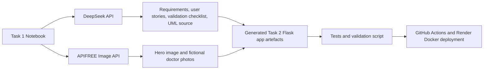

# AI Use And Governance Statement

This document explains how AI-specific tooling is used in the DTS114 Software Component and how the project keeps the generated outputs controlled, traceable, and coursework-safe.

## Short Summary

| Area | Project decision |
|---|---|
| AI purpose | Generate software artefacts and visual assets for an appointment administration prototype |
| Main text model | DeepSeek Chat Completions API |
| Main image model | APIFREE image API |
| Human boundary | AI output is generated, validated, tested, and kept inside a non-diagnostic appointment workflow |
| Safety boundary | No diagnosis, treatment advice, prescriptions, emergency triage, or real patient records |
| Secret handling | API keys are read from environment variables or local `.env`; they are not committed |

## AI Tooling Workflow

## Where AI Is Used

| Tool | What it generates | Why it supports the CW | Evidence path |
|---|---|---|---|
| DeepSeek | Draft requirements, user stories, validation checklist, and UML source | Shows AI-specific tooling for SDLC artefact generation rather than only static coding | `Task2/clinic_app/artifacts/deepseek_generation_metadata.json` |
| APIFREE | Login hero image | Meets the website requirement to display an automatically generated image | `Task2/clinic_app/artifacts/apifree_image_generation_metadata.json` |
| APIFREE | Fictional doctor profile photos | Strengthens the generated clinic appointment workflow with relevant AI-created visual data | `Task2/clinic_app/artifacts/doctor_photo_generation_metadata.json` |
| Deterministic generator code | Flask app, templates, CSS, JavaScript, tests, Docker, CI/CD, and documentation | Keeps Task 1 reproducible and able to regenerate Task 2 even if an external API is temporarily unavailable | `Task1/clinic_appointment_generator.ipynb` |

## DeepSeek Usage

The Task 1 notebook calls the DeepSeek Chat Completions API by default when `DEEPSEEK_API_KEY` is available. DeepSeek is used for SDLC-oriented generation, not for medical decision-making.

Generated DeepSeek artefacts include:

- Requirements for the clinic appointment administration problem.
- User stories and acceptance criteria for patient, doctor, and admin roles.
- Validation checklist items for safety, testing, deployment, and traceability.
- UML source text aligned with the generated Flask routes and appointment workflow.

The notebook then applies deterministic post-processing so the generated artefacts match the implemented endpoints, evidence paths, role boundaries, and safety wording. This is important because AI output is useful for drafting, but it still needs engineering control.

## APIFREE Usage

The Task 1 notebook calls the APIFREE image API by default when `APIFREE_API_KEY` is available. APIFREE is used only for visual assets that are directly relevant to the clinic appointment system.

Generated APIFREE image assets include:

- `Task2/clinic_app/static/generated_clinic_image.png`, displayed on the login page.
- Three fictional doctor profile photos under `Task2/clinic_app/static/doctors/`, displayed in the patient roster and staff schedule views.

The prompts intentionally request fictional, non-identifying, non-medical-decision imagery. The images support interface realism and generated media evidence; they do not affect appointment approval decisions.

## Runtime And Fallback Behaviour

The intended submitted run uses real API calls, and the committed metadata records successful generation. The notebook also contains deterministic fallbacks so that a marker can still regenerate a complete Task 2 folder if a third-party API is unavailable during marking.

| Environment variable | Default role |
|---|---|
| `DEEPSEEK_API_KEY` | Enables DeepSeek artefact generation |
| `ENABLE_LLM_GENERATION` | Uses API generation when enabled; set to `0` only for offline fallback |
| `APIFREE_API_KEY` | Enables APIFREE image generation |
| `ENABLE_IMAGE_API_GENERATION` | Uses API image generation when enabled; set to `0` only for offline fallback |
| `APIFREE_IMAGE_MODEL` | Optional image model override |
| `APIFREE_API_BASE` | Optional APIFREE base URL override |

The fallback path is not used to pretend that API calls happened. It writes clear metadata statuses so the generation mode remains transparent.

## Human Review And Validation

AI outputs are checked through a controlled workflow:

1. Task 1 generates artefacts and application code.
2. Metadata files record model, endpoint, timestamp, status, and output paths.
3. Tests verify the generated Flask app behaviour.
4. `scripts/validate_submission.py` checks required files, single-notebook structure, AI metadata, generated images, English-only text, screenshot evidence, and secret leakage.
5. Git commit history records the development steps.
6. GitHub Actions repeats validation in CI.
7. Render Docker deployment proves the generated app runs online.

## Safety Boundary

The application is limited to appointment administration:

- It can help a patient request a fictional clinic appointment.
- It can help a doctor or admin review, confirm, cancel, or reschedule appointment requests.
- It can show non-diagnostic administrative summaries.
- It cannot provide diagnosis, treatment advice, prescriptions, emergency triage, or clinical decision support.
- It must not be used with real patient data.

## Academic Integrity Boundary

This software component uses AI to generate and validate artefacts, but the student's final report and presentation reflection should remain their own explanation. The documentation here is evidence of the software process and should support the student's understanding rather than replace it.

## Main Evidence Files

| Evidence | Path |
|---|---|
| DeepSeek generation metadata | `Task2/clinic_app/artifacts/deepseek_generation_metadata.json` |
| APIFREE hero image metadata | `Task2/clinic_app/artifacts/apifree_image_generation_metadata.json` |
| APIFREE doctor photo metadata | `Task2/clinic_app/artifacts/doctor_photo_generation_metadata.json` |
| Generated requirements | `Task2/clinic_app/artifacts/generated_requirements.md` |
| Generated validation checklist | `Task2/clinic_app/artifacts/generated_validation_checklist.md` |
| UML source and visuals | `Task2/clinic_app/artifacts/diagrams/` |
| Test suite | `Task2/clinic_app/tests/test_app.py` |
| Submission validation script | `scripts/validate_submission.py` |
