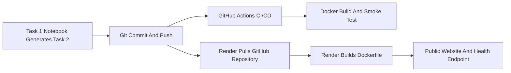

# Deployment And Evidence Guide

This document explains how the generated Flask app is run locally, containerised with Docker, validated through GitHub Actions, and deployed online with Render Docker.

## Deployment Evidence Summary

| Evidence type | Status | Location |
|---|---|---|
| GitHub repository | Available | https://github.com/XGS61/DTS114 |
| Git commit evidence | Available | `Task2/screenshots/01_commit_records.png` |
| GitHub Actions CI/CD | Passed | https://github.com/XGS61/DTS114/actions/runs/26996133341 |
| CI/CD screenshot | Available | `Task2/screenshots/03_cicd_workflow.png` |
| Render Docker website | Live | https://dts114-clinic-appointment-generator-g8md.onrender.com/ |
| Render Docker health check | Live | https://dts114-clinic-appointment-generator-g8md.onrender.com/health |
| Deployment screenshot | Available | `Task2/screenshots/02_deployed_website.png` |
| Local Docker smoke test | Passed | Same Dockerfile as Render |

## Local Run Versus Deployment

Running `python app.py` starts a local development server. This proves the generated Flask code works on the local machine, but it is not public deployment.

Deployment is demonstrated by this chain:



The deployed app is the same generated Task 2 code, built from the GitHub repository by Render.

## Render Docker Service

Primary service:

| Setting | Value |
|---|---|
| Service type | Web Service |
| Runtime | Docker |
| Repository | `https://github.com/XGS61/DTS114` |
| Branch | `main` |
| Root directory | `Task2/clinic_app` |
| Dockerfile path | `./Dockerfile` |
| Docker context | `.` |
| Health check path | `/health` |
| Current version | `v1.3.1` |

Primary URLs:

| Page | URL |
|---|---|
| Public login page | https://dts114-clinic-appointment-generator-g8md.onrender.com/ |
| App login page | https://dts114-clinic-appointment-generator-g8md.onrender.com/app/login |
| Health check | https://dts114-clinic-appointment-generator-g8md.onrender.com/health |

Expected health response:

```json
{
  "service": "clinic-appointment-generator",
  "status": "ok",
  "storage": "sqlite",
  "version": "v1.3.1"
}
```

## Render Deployment Steps

1. Open Render and connect the GitHub repository.
2. Create a new Web Service.
3. Select Docker runtime.
4. Set the root directory to `Task2/clinic_app`.
5. Confirm Dockerfile path `./Dockerfile`.
6. Confirm Docker context `.`.
7. Set health check path to `/health`.
8. Add `FLASK_SECRET_KEY` as an environment variable or allow Render to generate it from `render.yaml`.
9. Deploy from branch `main`.
10. Open `/` and `/health` after the deployment becomes live.

## Local Docker Verification

Run from `Task2/clinic_app`:

```bash
docker build -t dts114-clinic-app:v1.3.1 .
docker run --rm -p 5000:5000 -e FLASK_SECRET_KEY=local-docker-secret dts114-clinic-app:v1.3.1
```

Then open:

```text
http://127.0.0.1:5000/
http://127.0.0.1:5000/health
```

This local Docker run proves the image works in a container. Render uses the same Dockerfile to build an online version.

## GitHub Actions Workflow

Workflow file:

```text
.github/workflows/ci.yml
```

The workflow runs on pushes to `main`, pull requests to `main`, and manual workflow dispatch.

| CI step | Purpose |
|---|---|
| Checkout repository | Use the pushed GitHub version |
| Set up Python | Use Python 3.11 |
| Install dependencies | Install `Task2/clinic_app/requirements.txt` |
| Validate submission artefacts | Run `python scripts/validate_submission.py` |
| Compile Flask app | Run `python -m py_compile app.py` |
| Run tests | Run `python -m pytest` |
| Build Docker image | Build the generated Docker image |
| Smoke test Docker container | Start the container and call `/health` |

Latest successful run:

```text
https://github.com/XGS61/DTS114/actions/runs/26996133341
```

## Screenshot Evidence

| File | What it proves |
|---|---|
| `Task2/screenshots/01_commit_records.png` | GitHub commit records and version-control evidence |
| `Task2/screenshots/02_deployed_website.png` | Render public website with generated hero image |
| `Task2/screenshots/03_cicd_workflow.png` | GitHub Actions CI/CD success |

## Native Python Render Fallback

The project also keeps native Python deployment files as a fallback:

| File | Purpose |
|---|---|
| `Task2/clinic_app/runtime.txt` | Python runtime hint |
| `Task2/clinic_app/requirements.txt` | Flask, gunicorn, pytest dependencies |
| `Task2/clinic_app/render.yaml` | Docker-first Render blueprint |

Use the native Python fallback only if Docker service creation is blocked. The Docker deployment is stronger evidence for the containerisation chapter.

## Final Deployment Validation

Run these commands before final packaging:

```bash
python scripts/validate_submission.py --require-screenshots
```

```bash
curl https://dts114-clinic-appointment-generator-g8md.onrender.com/health
```

The health response should include `version: v1.3.1`.
