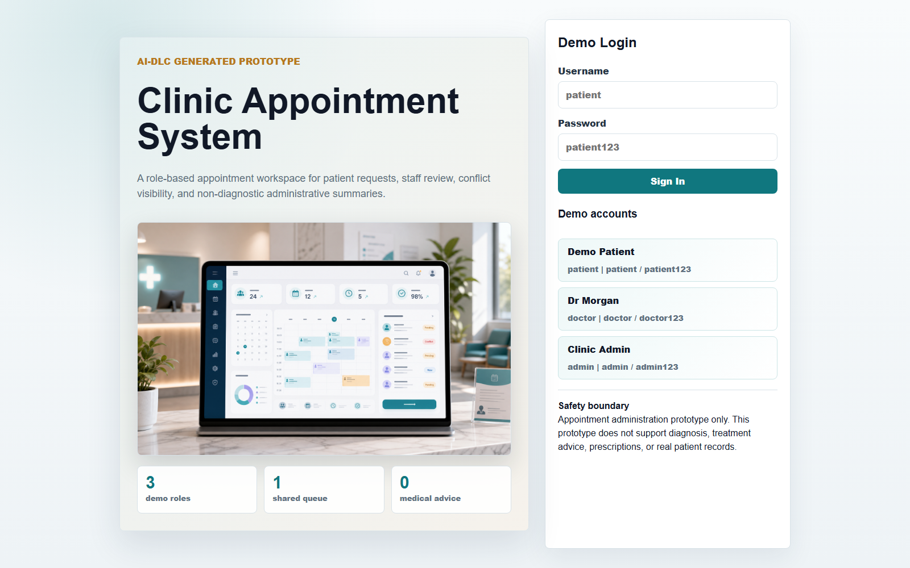
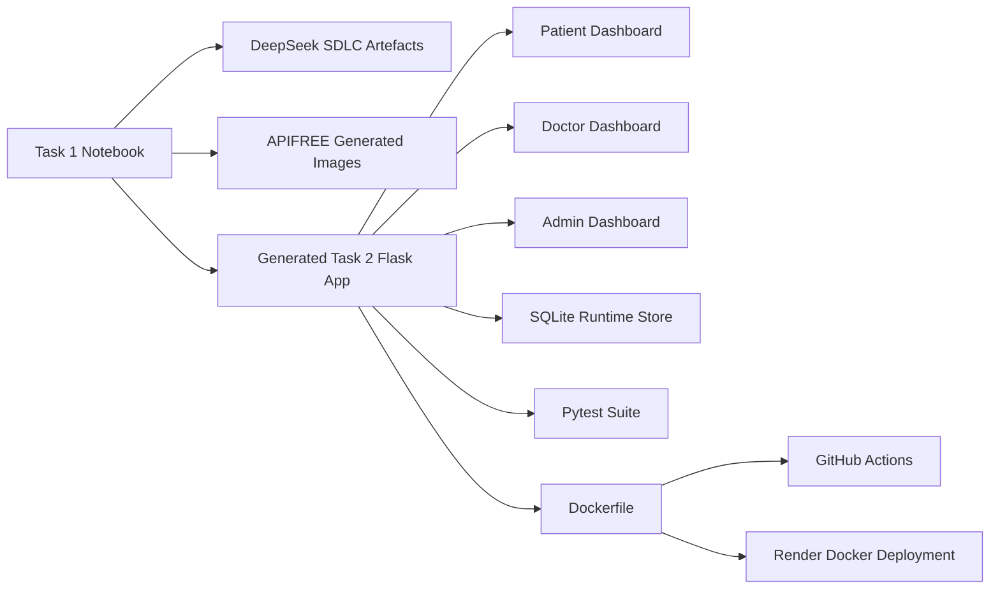
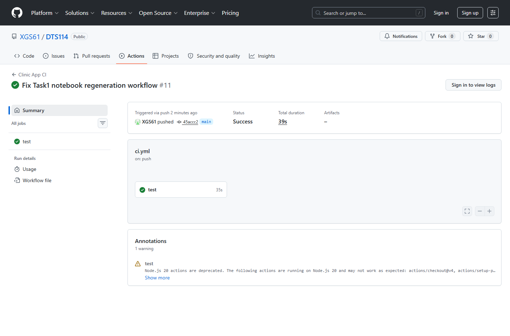

# DTS114 Clinic Appointment Generator

AI-DLC-informed coursework software component for generating and deploying a Flask-based clinic appointment administration prototype.

| Link | Value |
|---|---|
| Repository | https://github.com/XGS61/DTS114 |
| Deployed Docker website | https://dts114-clinic-appointment-generator-g8md.onrender.com/ |
| Health check | https://dts114-clinic-appointment-generator-g8md.onrender.com/health |
| Current release | `v1.3.1` |



## At A Glance

| Area | Evidence |
|---|---|
| Task 1 generator | `Task1/clinic_appointment_generator.ipynb` is the single notebook and can regenerate Task 2 from scratch |
| Generated Flask app | `Task2/clinic_app/app.py`, templates, static assets, tests, and deployment files |
| Generated image | `Task2/clinic_app/static/generated_clinic_image.png` displayed on the login page |
| Generated doctor photos | `Task2/clinic_app/static/doctors/` generated through APIFREE for fictional demo doctors |
| SDLC artefacts | `Task2/clinic_app/artifacts/` contains generated requirements, user stories, validation checklist, and UML |
| AI-specific tooling | DeepSeek metadata and APIFREE metadata are stored in `Task2/clinic_app/artifacts/` |
| Testing | `58` pytest tests plus syntax and submission validation checks |
| Version control | GitHub commit history and annotated tags `v1.3.0`, `v1.3.1` |
| CI/CD | GitHub Actions run: https://github.com/XGS61/DTS114/actions/runs/26996133341 |
| Deployment | Render Docker deployment using the same Dockerfile as local Docker |

## Coursework Requirement Coverage

| CW requirement or marking area | How this project addresses it | Main evidence path |
|---|---|---|
| One Jupyter Notebook for Task 1 | The notebook writes all Task 2 files, artefacts, tests, CI workflow, Docker files, and documentation | `Task1/clinic_appointment_generator.ipynb` |
| Automatically generate Flask API code | The notebook generates `app.py` with role-based Flask routes and SQLite-backed workflows | `Task2/clinic_app/app.py` |
| Automatically generate a website | The notebook generates login, registration, patient, and staff/admin pages | `Task2/clinic_app/templates/`, `Task2/clinic_app/static/` |
| Website displays an automatically generated image | The login page displays the APIFREE-generated hero image | `Task2/clinic_app/static/generated_clinic_image.png` |
| Generate traditional SDLC documentation | Requirements, user stories, validation checklist, and UML source/visuals are generated | `Task2/clinic_app/artifacts/` |
| UML generation | Use case, sequence, activity, and component diagrams are included | `Task2/clinic_app/artifacts/diagrams/` |
| Effective AI-specific tooling | DeepSeek generates SDLC artefacts; APIFREE generates visual assets; metadata records status, model, endpoint, and usage | `deepseek_generation_metadata.json`, `apifree_image_generation_metadata.json`, `doctor_photo_generation_metadata.json` |
| Version control | Meaningful commits and version tags show iterative development | `Task2/screenshots/01_commit_records.png` |
| Workflow and CI/CD | GitHub Actions validates structure, compiles code, runs tests, builds Docker, and smoke-tests the container | `.github/workflows/ci.yml`, `Task2/screenshots/03_cicd_workflow.png` |
| Testing | Unit and integration tests cover API, roles, validation, scheduling, audit, metadata, and UI text checks | `Task2/clinic_app/tests/test_app.py` |
| Deployment | Render Docker deployment exposes the generated Flask website and API online | `Task2/screenshots/02_deployed_website.png`, `DEPLOYMENT.md` |

## System Overview



## Business Problem

Clinic staff need a safe appointment administration prototype that separates patient booking from doctor/admin review. The system supports fictional demo data only. It does not store real patient records and does not provide diagnosis, treatment advice, prescriptions, or clinical decision support.

## Main Product Features

| User type | Main capabilities |
|---|---|
| Patient | Register or sign in, select a future weekday, choose a fictional doctor, view available slots, create appointment requests, view own appointments, cancel own requests, request pending reschedules |
| Doctor | Sign in to a linked doctor account, see only own queue, review own appointments, reschedule own appointments with notes, view own day schedule, manage own department/room/focus/shift/capacity/profile/photo |
| Admin | See all queues, review all appointments, manage all doctor profiles, create doctor accounts and patient-visible doctor profiles |
| System | Enforce scheduling rules, conflict visibility, role boundaries, audit events, non-diagnostic summaries, generated metadata, and validation checks |

## Generated Task 2 Structure

```text
StudentID-Your_Name/
  environment.yml
  README.md
  AI_USE.md
  DEPLOYMENT.md
  SUBMISSION_CHECKLIST.md
  Task1/
    clinic_appointment_generator.ipynb
  Task2/
    clinic_app/
      app.py
      Dockerfile
      requirements.txt
      render.yaml
      runtime.txt
      templates/
      static/
        generated_clinic_image.png
        doctors/
        uploads/
      tests/
      artifacts/
      data/
    screenshots/
  .github/
    workflows/
      ci.yml
  scripts/
    validate_submission.py
```

## Run Task 1 Generator

Task 1 is the source of generation. If `Task2/` is deleted, running the notebook recreates the Flask app, website, generated image, doctor photos, SDLC artefacts, tests, CI workflow, Docker files, Render config, screenshot guide, and documentation.

From the repository root:

```bash
jupyter nbconvert --to notebook --execute --inplace Task1/clinic_appointment_generator.ipynb
```

The notebook can also be opened and run cell by cell in Jupyter.

### API Behaviour

The notebook reads optional API keys from environment variables or from a local `.env` file. The `.env` file is ignored by Git and must not be submitted.

| Variable | Purpose |
|---|---|
| `DEEPSEEK_API_KEY` | Enables DeepSeek generation for requirements, user stories, validation checklist, and UML source |
| `ENABLE_LLM_GENERATION` | Defaults to API generation when the key exists; set to `0` only for offline fallback |
| `APIFREE_API_KEY` | Enables APIFREE generation for the login hero image and fictional doctor roster photos |
| `ENABLE_IMAGE_API_GENERATION` | Defaults to API image generation when the key exists; set to `0` only for offline fallback |
| `APIFREE_IMAGE_MODEL` | Optional model override, default `Qwen/Qwen-Image` |
| `APIFREE_API_BASE` | Optional API base URL, default `https://api.apifree.ai` |
| `APIFREE_MAX_POLLS` | Optional image polling limit, default `120` |
| `APIFREE_POLL_SECONDS` | Optional delay between polls, default `2` |

Latest committed metadata shows:

| API | Status | Evidence |
|---|---|---|
| DeepSeek | `generated` | `Task2/clinic_app/artifacts/deepseek_generation_metadata.json` |
| APIFREE hero image | `generated` | `Task2/clinic_app/artifacts/apifree_image_generation_metadata.json` |
| APIFREE doctor photos | `3 generated, 0 fallback` | `Task2/clinic_app/artifacts/doctor_photo_generation_metadata.json` |

## Local Python Setup

Create the recommended Conda environment from the repository root:

```bash
conda env create -f environment.yml
conda activate dts114-clinic-generator
```

Or use a standard Python environment for Task 2 only:

```bash
cd Task2/clinic_app
python -m pip install -r requirements.txt
```

## Run The Flask App Locally

```bash
cd Task2/clinic_app
python app.py
```

Open:

| Page | URL |
|---|---|
| Login | http://127.0.0.1:5000/ |
| Register | http://127.0.0.1:5000/app/register |
| Patient dashboard | http://127.0.0.1:5000/app/patient |
| Staff dashboard | http://127.0.0.1:5000/app/staff |
| Health check | http://127.0.0.1:5000/health |

`python app.py` starts a local development instance only. Online deployment is shown by GitHub commits, GitHub Actions, Render Docker build, the public Render URL, and screenshot evidence.

## Demo Accounts

| Role | Username | Password | Scope |
|---|---|---|---|
| Patient | `patient` | `patient123` | Submit and manage own appointment requests |
| Doctor | `doctor` | `doctor123` | Manage only the linked `Dr Amelia Hart` queue and profile |
| Admin | `admin` | `admin123` | Manage all appointment queues and doctor accounts |

The Sign In page also links to a separate Sign Up page. Registered passwords are hashed with Werkzeug. This is prototype authentication for coursework evidence, not production identity management.

## Core API Endpoints

| Method | Endpoint | Purpose |
|---|---|---|
| `GET` | `/health` | Service health and version |
| `POST` | `/api/auth/login` | Start a session |
| `POST` | `/api/auth/register` | Create prototype patient, doctor, or admin account |
| `POST` | `/api/auth/logout` | End session |
| `GET` | `/api/auth/session` | Inspect current session |
| `GET` | `/api/doctors?date=YYYY-MM-DD` | List scheduled doctors and slots for a date |
| `GET` | `/api/doctors/<doctor_id>/availability?date=YYYY-MM-DD` | Doctor-specific availability |
| `GET/PATCH` | `/api/doctors/me` | Doctor profile management |
| `POST` | `/api/doctors/me/photo` | Doctor profile photo upload |
| `GET/POST` | `/api/admin/doctors` | Admin doctor list and creation |
| `GET` | `/api/schedule/day?date=YYYY-MM-DD` | Staff day-board |
| `POST` | `/api/appointments` | Create pending appointment request |
| `GET` | `/api/appointments` | List visible appointments with filters and pagination |
| `PATCH` | `/api/appointments/<id>/review` | Staff review decision |
| `PATCH` | `/api/appointments/<id>/cancel` | Patient cancellation |
| `PATCH` | `/api/appointments/<id>/reschedule` | Patient or staff reschedule workflow |
| `GET` | `/api/appointments/<id>/audit` | Staff audit trail |
| `GET` | `/api/appointments/<id>/summary` | Non-diagnostic administrative summary |
| `GET` | `/api/meta/requirements` | Generated requirements metadata |

## Scheduling and Safety Rules

- Appointment dates must be future weekdays.
- Slots must fit the selected doctor's weekday shift.
- Slot length uses 30-minute increments by default.
- Capacity is checked by doctor, date, and time.
- Conflicts are recalculated after create, review, cancel, and reschedule actions.
- Review and reschedule actions require administrative notes.
- Doctor accounts only see appointments linked to their own doctor profile.
- Admin accounts can see all appointment queues.
- Summaries remain administrative and non-diagnostic.
- The app does not support diagnosis, treatment advice, prescriptions, or real patient records.

## Testing And Validation

Run from `Task2/clinic_app`:

```bash
python -m py_compile app.py
python -m pytest
```

Run from the repository root:

```bash
python scripts/validate_submission.py
python scripts/validate_submission.py --require-screenshots
```

Current verification result:

| Check | Result |
|---|---|
| Python syntax | Passed |
| JavaScript syntax | Passed |
| Pytest suite | `58 passed` |
| Submission validation | Passed |
| Screenshot validation | Passed |
| Local Docker smoke test | Passed |
| GitHub Actions | Passed |
| Render Docker health check | Passed |

## Local Docker

The same Dockerfile is used for local Docker evidence and Render Docker deployment.

```bash
cd Task2/clinic_app
docker build -t dts114-clinic-app:v1.3.1 .
docker run --rm -p 5000:5000 -e FLASK_SECRET_KEY=local-docker-secret dts114-clinic-app:v1.3.1
```

Open `http://127.0.0.1:5000/`.

Docker is a containerised runtime. Local Docker proves that the app can run in a reproducible container on the marking machine. Render Docker proves that the same containerised app can run online as a public website.

## Render Deployment

Primary deployed service:

| Item | URL |
|---|---|
| Public website | https://dts114-clinic-appointment-generator-g8md.onrender.com/ |
| Health check | https://dts114-clinic-appointment-generator-g8md.onrender.com/health |

Expected health response:

```json
{
  "service": "clinic-appointment-generator",
  "status": "ok",
  "storage": "sqlite",
  "version": "v1.3.1"
}
```

See `DEPLOYMENT.md` for the full Render setup and evidence guide.

## Git, Versioning, And CI/CD Evidence

| Evidence | Path or URL |
|---|---|
| GitHub repository | https://github.com/XGS61/DTS114 |
| Latest feature tag | `v1.3.1` |
| CI run | https://github.com/XGS61/DTS114/actions/runs/26996133341 |
| Commit screenshot | `Task2/screenshots/01_commit_records.png` |
| Deployment screenshot | `Task2/screenshots/02_deployed_website.png` |
| CI/CD screenshot | `Task2/screenshots/03_cicd_workflow.png` |



## Runtime Data And Git Policy

| Data type | Policy |
|---|---|
| SQLite database | Created at runtime under `Task2/clinic_app/data/clinic.sqlite3`; ignored by Git |
| Runtime uploaded doctor photos | Stored under `Task2/clinic_app/static/uploads/doctors/`; ignored by Git except `.gitkeep` |
| API keys | Stored only in local `.env`; ignored by Git |
| Generated doctor demo photos | Committed under `Task2/clinic_app/static/doctors/` as APIFREE-generated coursework evidence |
| Screenshot evidence | Committed under `Task2/screenshots/` |

## Packaging Checklist

Before final submission:

1. Rename `StudentID-Your_Name` to the real student ID and name if required by the submission system.
2. Confirm `Task1/` contains exactly one notebook.
3. Run `python scripts/validate_submission.py --require-screenshots`.
4. Confirm `.env` is not included.
5. Confirm no real patient data is included.
6. Confirm the three screenshots exist in `Task2/screenshots/`.
7. Confirm the deployed Render website and `/health` endpoint still load.

## Supporting Documents

| Document | Purpose |
|---|---|
| `Task2/clinic_app/README.md` | Detailed Flask app usage and API reference |
| `AI_USE.md` | AI tooling, metadata, safety, and academic integrity statement |
| `DEPLOYMENT.md` | GitHub, CI/CD, Docker, Render, and screenshot evidence guide |
| `SUBMISSION_CHECKLIST.md` | Final packaging checklist |
| `REFERENCES.md` | Tool and documentation references |
